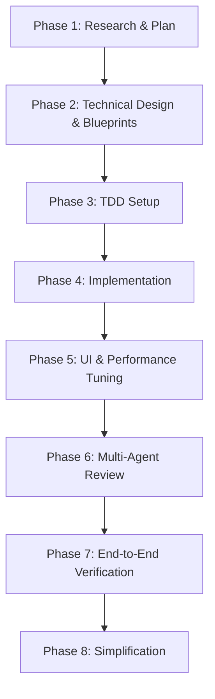

# Agent Orchestration and Development Guide

This guide is designed for **Antigravity** (and other AI agents) to coordinate work within this codebase. It defines custom sub-agents, context-specific skills, syntax rules, and a sequential development workflow for building new features.

---

## 1. Custom Agents (`.ai/agents/`)

These specialized agents are configured to perform specific roles. When working on a feature, you can "spawn" or delegate context-specific analysis to these agents.

| Agent | Config File | Primary Purpose / Role |
| :--- | :--- | :--- |
| **planner** | [planner.md](../.ai/agents/planner.md) | Analyzes requirements, checks codebase dependencies, and creates implementation plans. |
| **architect** | [architect.md](../.ai/agents/architect.md) | High-level system design, scalability choices, and architectural patterns. |
| **code-architect** | [code-architect.md](../.ai/agents/code-architect.md) | Creates concrete feature blueprints, files list, structures, interfaces, and build order. |
| **typescript-reviewer** | [typescript-reviewer.md](../.ai/agents/typescript-reviewer.md) | TypeScript code reviewer checking types, async/await logic, and web standards. |
| **react-reviewer** | [react-reviewer.md](../.ai/agents/react-reviewer.md) | React reviewer checking hook rules, hydration issues, client/server boundaries, and renders. |
| **database-reviewer** | [database-reviewer.md](../.ai/agents/database-reviewer.md) | PostgreSQL reviewer validating schema design, indexing, transactions, and locking. |
| **security-reviewer** | [security-reviewer.md](../.ai/agents/security-reviewer.md) | Security auditor identifying vulnerabilities (OWASP, inputs validation, secret leakages). |
| **code-reviewer** | [code-reviewer.md](../.ai/agents/code-reviewer.md) | General code quality reviewer ensuring cleanliness, comments, and structure. |
| **a11y-architect** | [a11y-architect.md](../.ai/agents/a11y-architect.md) | Accessibility consultant auditing markup and assets for WCAG 2.2 compliance. |
| **seo-specialist** | [seo-specialist.md](../.ai/agents/seo-specialist.md) | SEO reviewer ensuring optimal sitemaps, metadata tag lists, and Core Web Vitals. |
| **e2e-runner** | [e2e-runner.md](../.ai/agents/e2e-runner.md) | Testing runner executing Playwright E2E tests and checking user flows. |
| **build-error-resolver** | [build-error-resolver.md](../.ai/agents/build-error-resolver.md) | Resolves compilation issues, TypeScript type errors, and bundler failures. |
| **react-build-resolver** | [react-build-resolver.md](../.ai/agents/react-build-resolver.md) | Fixes React-specific bundler/compilation issues (Vite, Next.js, hydration). |
| **code-simplifier** | [code-simplifier.md](../.ai/agents/code-simplifier.md) | Refactors verified logic to improve readability, reducing nesting and code complexity. |
| **tdd-guide** | [tdd-guide.md](../.ai/agents/tdd-guide.md) | Enforces test-first development workflows and 80%+ coverage metrics. |
| **type-design-analyzer** | [type-design-analyzer.md](../.ai/agents/type-design-analyzer.md) | Audits TypeScript types, interfaces, and boundaries for domain-driven safety. |

---

## 2. Skills Registry (`.ai/skills/`)

Skills are modular instruction directories. When performing tasks in a specific domain, **you MUST load the skill's instructions** by reading its `SKILL.md` file using the `view_file` tool.

| Skill | Path to Instruction File | Domain Scope / Purpose |
| :--- | :--- | :--- |
| **accessibility** | [SKILL.md](../.ai/skills/accessibility/SKILL.md) | Inclusive web design principles and WCAG audits. |
| **api-design** | [SKILL.md](../.ai/skills/api-design/SKILL.md) | REST API naming conventions, responses, and error structures. |
| **backend-patterns** | [SKILL.md](../.ai/skills/backend-patterns/SKILL.md) | Server patterns, query building, caching, and background workers. |
| **best-practices** | [SKILL.md](../.ai/skills/best-practices/SKILL.md) | Repository-wide security, modularity, and naming rules. |
| **coding-standards** | [SKILL.md](../.ai/skills/coding-standards/SKILL.md) | Code styling, project layout conventions, and directory usage. |
| **core-web-vitals** | [SKILL.md](../.ai/skills/core-web-vitals/SKILL.md) | LCP, FID, CLS, INP tuning and measurements. |
| **database-migrations** | [SKILL.md](../.ai/skills/database-migrations/SKILL.md) | Zero-downtime schemas, SQL updates, and rollbacks. |
| **deployment-patterns** | [SKILL.md](../.ai/skills/deployment-patterns/SKILL.md) | Pipelines, build configurations, and environment checks. |
| **docker-patterns** | [SKILL.md](../.ai/skills/docker-patterns/SKILL.md) | Container configurations, Compose patterns, and dev-vs-prod configs. |
| **e2e-testing** | [SKILL.md](../.ai/skills/e2e-testing/SKILL.md) | Playwright configurations, Page Object Models, and assertion helpers. |
| **frontend-a11y** | [SKILL.md](../.ai/skills/frontend-a11y/SKILL.md) | Practical ARIA usage, focus loops, and semantic components in React. |
| **frontend-design-direction** | [SKILL.md](../.ai/skills/frontend-design-direction/SKILL.md) | Product-specific CSS tokens, animations, and typography directions. |
| **frontend-patterns** | [SKILL.md](../.ai/skills/frontend-patterns/SKILL.md) | React state, query fetching, UI context, and layout setups. |
| **nextjs-turbopack** | [SKILL.md](../.ai/skills/nextjs-turbopack/SKILL.md) | Optimization rules for NextJS Turbopack bundler and page loads. |
| **nodejs-keccak256** | [SKILL.md](../.ai/skills/nodejs-keccak256/SKILL.md) | Hashing utilities for crypto operations in Node.js. |
| **performance** | [SKILL.md](../.ai/skills/performance/SKILL.md) | General caching and execution efficiency optimizations. |
| **postgres-patterns** | [SKILL.md](../.ai/skills/postgres-patterns/SKILL.md) | PostgreSQL query tuning, join optimizations, and indexes. |
| **react-patterns** | [SKILL.md](../.ai/skills/react-patterns/SKILL.md) | React hooks, Suspense, client/server boundaries, and Form Actions. |
| **react-performance** | [SKILL.md](../.ai/skills/react-performance/SKILL.md) | Renders throttling, virtual lists, and bundle splitting. |
| **react-testing** | [SKILL.md](../.ai/skills/react-testing/SKILL.md) | React Testing Library patterns, MSW setups, and unit testing. |
| **redis-patterns** | [SKILL.md](../.ai/skills/redis-patterns/SKILL.md) | Caching policies, locks, and rates-limiting via Redis. |
| **security-review** | [SKILL.md](../.ai/skills/security-review/SKILL.md) | Static scanning targets, input sanitization details. |
| **seo** | [SKILL.md](../.ai/skills/seo/SKILL.md) | Structured JSON-LD schema layouts, sitemaps, and indexing instructions. |
| **tdd-workflow** | [SKILL.md](../.ai/skills/tdd-workflow/SKILL.md) | Details on setting up and enforcing the Red-Green-Refactor sequence. |
| **verification-loop** | [SKILL.md](../.ai/skills/verification-loop/SKILL.md) | Systematic scripts verification and regression-free coding loops. |
| **web-audit** | [SKILL.md](../.ai/skills/web-audit/SKILL.md) | Auditing checklists covering performance, a11y, and general quality. |

---

## 3. Rules Configuration (`.ai/rules/`)

Rules are structural instructions compiled automatically for the IDE. These files should be read to ensure consistency with the repository style.

### Common Rules (`.ai/rules/common/`)
- [agents.md](../.ai/rules/common/agents.md): Sub-agent guidelines and orchestration details.
- [code-review.md](../.ai/rules/common/code-review.md): Review checklist and formatting checks.
- [coding-style.md](../.ai/rules/common/coding-style.md): General layout, spacing, naming, and language rules.
- [development-workflow.md](../.ai/rules/common/development-workflow.md): Planning, approval, and execution boundaries.
- [git-workflow.md](../.ai/rules/common/git-workflow.md): Commit naming structure and branching standards.
- [hooks.md](../.ai/rules/common/hooks.md): Hooks composition standards.
- [patterns.md](../.ai/rules/common/patterns.md): Core coding patterns and conventions.
- [performance.md](../.ai/rules/common/performance.md): General latency and efficiency guidelines.
- [security.md](../.ai/rules/common/security.md): Threat vectors and data access controls.
- [testing.md](../.ai/rules/common/testing.md): General testing standards.

### TypeScript-Specific Rules (`.ai/rules/typescript/`)
- [coding-style.md](../.ai/rules/typescript/coding-style.md): Type assertions rules, module formats, and type safety constraints.
- [hooks.md](../.ai/rules/typescript/hooks.md): TypeScript hooks types and signatures constraints.
- [patterns.md](../.ai/rules/typescript/patterns.md): TS domain schemas, invariants, and generic constraints.
- [security.md](../.ai/rules/typescript/security.md): Checking TS injections and dependencies.
- [testing.md](../.ai/rules/typescript/testing.md): Typing tests, mock interfaces, and assertions.

---

## 4. Dedicated Slash Workflows (`.agents/workflows/`)

Antigravity registers workflows placed in `.agents/workflows/` as custom slash commands. Use the following dedicated pipelines for building features:

- **Frontend Features**: [frontend-feature.md](workflows/frontend-feature.md) (Trigger via `/frontend-feature <ui_feature_description>`) - Custom sequence for UI styling, accessibility (WCAG), and Web Vitals metrics.
- **Backend Features**: [backend-feature.md](workflows/backend-feature.md) (Trigger via `/backend-feature <backend_feature_description>`) - Custom sequence for schema designs, API controllers, secure inputs, and database reviews.

---

## 5. General Feature Development Sequence

When building features manually or guiding autonomous agents, follow this sequence:

### Phase 1: Research, Requirements & Plan
* **Objective**: Define requirements, research current code modules, identify blockers, and align on an execution plan.
* **Relevant Agents**:
  * [planner](../.ai/agents/planner.md): Analyzes requirements and drafts the plan.
  * [architect](../.ai/agents/architect.md): Identifies high-level components and dependencies.
* **Relevant Skills**:
  * [best-practices](../.ai/skills/best-practices/SKILL.md): Core coding expectations.
  * [coding-standards](../.ai/skills/coding-standards/SKILL.md): Repository structures.
* **Relevant Rules**:
  * [development-workflow.md](../.ai/rules/common/development-workflow.md): Enforces planning boundaries.
  * [patterns.md](../.ai/rules/common/patterns.md): General style boundaries.
* **Required Action**: Write and output `implementation_plan.md` listing steps, affected files, tests strategy, and risk factors. Ask for user approval.

### Phase 2: Technical Design & Concrete Blueprints
* **Objective**: Define code boundaries, database schemas, interfaces, type systems, and API schemas before writing implementation code.
* **Relevant Agents**:
  * [code-architect](../.ai/agents/code-architect.md): Designs code flow, types, schemas, and signatures.
* **Relevant Skills**:
  * [api-design](../.ai/skills/api-design/SKILL.md): Standard REST API constraints.
  * [postgres-patterns](../.ai/skills/postgres-patterns/SKILL.md): Migration layouts.
* **Relevant Rules**:
  * [patterns.md](../.ai/rules/common/patterns.md)
  * [typescript/patterns.md](../.ai/rules/typescript/patterns.md)
* **Required Action**: Define TS models/interfaces or SQL migrations. Write contract draft inputs/outputs and obtain alignment.

### Phase 3: Test-Driven Development (TDD) Setup
* **Objective**: Write automated unit, integration, or E2E tests that describe the user story/logic and ensure they fail.
* **Relevant Agents**:
  * [tdd-guide](../.ai/agents/tdd-guide.md): Guides red-to-green refactoring loops.
* **Relevant Skills**:
  * [tdd-workflow](../.ai/skills/tdd-workflow/SKILL.md): TDD process instructions.
  * [react-testing](../.ai/skills/react-testing/SKILL.md) / [e2e-testing](../.ai/skills/e2e-testing/SKILL.md)
* **Relevant Rules**:
  * [testing.md](../.ai/rules/common/testing.md)
  * [typescript/testing.md](../.ai/rules/typescript/testing.md)
* **Required Action**: Create test files and add failing assertions. Run tests locally and verify they fail for correct missing logic.

### Phase 4: Core Implementation & Domain modeling
* **Objective**: Write minimal, clean production code to make all unit/integration tests pass.
* **Relevant Agents**:
  * [type-design-analyzer](../.ai/agents/type-design-analyzer.md): Analyzes TS type boundaries.
  * [build-error-resolver](../.ai/agents/build-error-resolver.md) / [react-build-resolver](../.ai/agents/react-build-resolver.md): Triggered for build fixes.
* **Relevant Skills**:
  * [frontend-patterns](../.ai/skills/frontend-patterns/SKILL.md) / [backend-patterns](../.ai/skills/backend-patterns/SKILL.md)
  * [react-patterns](../.ai/skills/react-patterns/SKILL.md)
  * [nodejs-keccak256](../.ai/skills/nodejs-keccak256/SKILL.md) (if crypto/hashing required)
* **Relevant Rules**:
  * [coding-style.md](../.ai/rules/common/coding-style.md)
  * [typescript/coding-style.md](../.ai/rules/typescript/coding-style.md)
* **Required Action**: Write production code. Build code and run tests until all tests turn green.

### Phase 5: UI, Accessibility, SEO & Performance Optimization
* **Objective**: Enhance user experiences, add accessibility cues, set up SEO, and resolve performance hotspots.
* **Relevant Agents**:
  * [a11y-architect](../.ai/agents/a11y-architect.md): WCAG auditing.
  * [seo-specialist](../.ai/agents/seo-specialist.md): SEO tag lists review.
* **Relevant Skills**:
  * [accessibility](../.ai/skills/accessibility/SKILL.md) / [frontend-a11y](../.ai/skills/frontend-a11y/SKILL.md)
  * [seo](../.ai/skills/seo/SKILL.md)
  * [performance](../.ai/skills/performance/SKILL.md) / [core-web-vitals](../.ai/skills/core-web-vitals/SKILL.md)
  * [react-performance](../.ai/skills/react-performance/SKILL.md)
* **Relevant Rules**:
  * [performance.md](../.ai/rules/common/performance.md)
  * [hooks.md](../.ai/rules/common/hooks.md) / [typescript/hooks.md](../.ai/rules/typescript/hooks.md)
* **Required Action**: Audit component render calls, add ARIA attributes, semantic markup, meta layout tags, and index optimization.

### Phase 6: Multi-Perspective Code Review & Security Audit
* **Objective**: Evaluate code quality, type checks, data leaks, SQL injections, and logic errors.
* **Relevant Agents**:
  * [code-reviewer](../.ai/agents/code-reviewer.md): Formats, clean architecture checks.
  * [typescript-reviewer](../.ai/agents/typescript-reviewer.md) / [react-reviewer](../.ai/agents/react-reviewer.md): Runtime errors, TS practices, hook bugs.
  * [database-reviewer](../.ai/agents/database-reviewer.md) (if DB files modified): DB injection, locks, transactions.
  * [security-reviewer](../.ai/agents/security-reviewer.md): OWASP threats, authorization, secrets checks.
* **Relevant Skills**:
  * [security-review](../.ai/skills/security-review/SKILL.md)
  * [database-migrations](../.ai/skills/database-migrations/SKILL.md)
* **Relevant Rules**:
  * [code-review.md](../.ai/rules/common/code-review.md)
  * [security.md](../.ai/rules/common/security.md)
  * [typescript/security.md](../.ai/rules/typescript/security.md)
* **Required Action**: Conduct line-by-line code review, check inputs, variables exposure, SQL schemas, and fix items raised by the review.

### Phase 7: End-to-End Testing & Verification Loop
* **Objective**: Run the entire integrated application, execute E2E test flows, build artifacts, and document tests.
* **Relevant Agents**:
  * [e2e-runner](../.ai/agents/e2e-runner.md): Playwright test execution.
* **Relevant Skills**:
  * [verification-loop](../.ai/skills/verification-loop/SKILL.md): End-to-end regression validation loops.
  * [e2e-testing](../.ai/skills/e2e-testing/SKILL.md)
* **Relevant Rules**:
  * [testing.md](../.ai/rules/common/testing.md)
* **Required Action**: Execute verification scripts, generate E2E walkthroughs, confirm all test states are green, and document findings in `walkthrough.md`.

### Phase 8: Code Simplification & Clean-up
* **Objective**: Refactor the verified codebase to make it simpler and cleaner without changing code behavior.
* **Relevant Agents**:
  * [code-simplifier](../.ai/agents/code-simplifier.md): Simplifies logic.
* **Relevant Skills**:
  * [best-practices](../.ai/skills/best-practices/SKILL.md)
  * [coding-standards](../.ai/skills/coding-standards/SKILL.md)
* **Relevant Rules**:
  * [coding-style.md](../.ai/rules/common/coding-style.md)
* **Required Action**: Refactor complex functions, clean up variables/comments, run testing suite to verify zero regressions.
